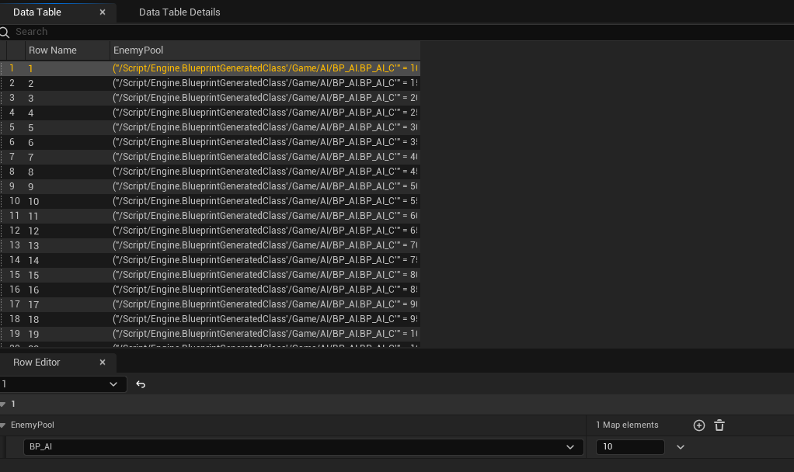

### Week 0 - 2
* To start with I did some research on my limb mechanic, and what I found was a dismemberment system I could modify to make detachable limbs. My main inspiration for this game is It takes Two (It Takes Two on Steam. https://store.steampowered.com/app/1426210/It_Takes_Two/. Accessed 5 Dec. 2024.) I liked the idea of a small toy character in a big ovesized world. In this game the characters use many different objects and I thought instead of objects the player would have attachments for its limbs to create unique weapons and a unique character design. For instance the character could have   

* How To Make Dismemberment System Unreal Engine 4 by Unreal University
<iframe width="560" height="315" src="https://www.youtube.com/embed/g47tNmkVjlQ?si=couFAD1s4SxcVxKn" title="YouTube video player" frameborder="0" allow="accelerometer; autoplay; clipboard-write; encrypted-media; gyroscope; picture-in-picture; web-share" referrerpolicy="strict-origin-when-cross-origin" allowfullscreen></iframe>

> # Creating a Model in Maya
> 

* Then I created a simple character in Maya for my character model, I was aiming for a robot look with destinctive limbs, however, my 3D modeling is quite limited so I went for a simple look instead.

# Creating the modular character

* How To Make Dismemberment System Unreal Engine 4 by Unreal University
<iframe width="560" height="315" src="https://www.youtube.com/embed/g47tNmkVjlQ?si=C11Mral8xIPUgebs" title="YouTube video player" frameborder="0" allow="accelerometer; autoplay; clipboard-write; encrypted-media; gyroscope; picture-in-picture; web-share" referrerpolicy="strict-origin-when-cross-origin" allowfullscreen></iframe>

* after that research I started to attempt to do the dismemberment system.

<iframe src="https://blueprintue.com/render/2l48xufd/" scrolling="no" allowfullscreen></iframe>

After using this code I realised it broke my project so I will be putting that aside and focus on getting the main mechanic working

 

# Rigging the character

* How to Use the Skeletal Rig Editor in Unreal Engine 5.3 ! By Nicolas Noseda

<iframe width="560" height="315" src="https://www.youtube.com/embed/txFsPf-BlEg?si=nLPjOkxV6V_BIXLX" title="YouTube video player" frameborder="0" allow="accelerometer; autoplay; clipboard-write; encrypted-media; gyroscope; picture-in-picture; web-share" referrerpolicy="strict-origin-when-cross-origin" allowfullscreen></iframe>

 
<iframe width="560" height="315" src="https://www.youtube.com/embed/ip76rN-x1Vo?si=C24WJgMbY8mJT_q8" title="YouTube video player" frameborder="0" allow="accelerometer; autoplay; clipboard-write; encrypted-media; gyroscope; picture-in-picture; web-share" referrerpolicy="strict-origin-when-cross-origin" allowfullscreen></iframe>

*

* I then followed this tutorial that showed me the basics of rigging bipedal model characters using the skeletal rig editor, this will allow me to add physics amd animations to the character.

### Week 3 - 4
* I added some animations to my character from Mixamo. 
Mixamo. https://www.mixamo.com/#/. Accessed 3 Dec. 2024.

> 

>

* How To Make An Animation Blueprint In Unreal Engine 5.1 | How to Animate A Character - UE5 Tutorial by Matt Aspland
<iframe width="560" height="315" src="https://www.youtube.com/embed/qbgDaRo312k?si=2xrGmaeQy6lIxZit" title="YouTube video player" frameborder="0" allow="accelerometer; autoplay; clipboard-write; encrypted-media; gyroscope; picture-in-picture; web-share" referrerpolicy="strict-origin-when-cross-origin" allowfullscreen></iframe>
> 
<iframe width="560" height="315" src="https://www.youtube.com/embed/Ys4PgdsNPwo?si=21ZLpT34IZY_x3QK" title="YouTube video player" frameborder="0" allow="accelerometer; autoplay; clipboard-write; encrypted-media; gyroscope; picture-in-picture; web-share" referrerpolicy="strict-origin-when-cross-origin" allowfullscreen></iframe>

> # Glitched files
* when I try to open or move these files it breaks my game, I cannot even delete them.

 

* I keep having issues with this modular system so I am going to put it on the back burner for now to focus on other things.
* My github saves seem to be corrupted I cant go back any amount of saves as it will just crash. At this point I may scrap the modular character and focus on making a quirky platformer instead.
* After closer inspection my third person character was glitched too.

>### Shooter Mechanic

* How To Make A Third Person Shooter - Unreal Engine 5 Tutorial By Pitchfork Academy (MizzoFrizzo & Co.)
<iframe width="560" height="315" src="https://www.youtube.com/embed/-IM5IE_XiLI?si=Mz-VSTPVwoS6rV7x" title="YouTube video player" frameborder="0" allow="accelerometer; autoplay; clipboard-write; encrypted-media; gyroscope; picture-in-picture; web-share" referrerpolicy="strict-origin-when-cross-origin" allowfullscreen></iframe>

Due to Fab I cannot find this asset pack and Get an error when I try to look it up.

* Military Weapons Dark By Adia Entertinment - Weapons
https://www.fab.com/listings/480fc7b6-4b4b-42b4-829a-9690b16dcff2

>

<iframe width="560" height="315" src="https://www.youtube.com/embed/ZI2LhaUOyak?si=4d6xELnh2iOx_pzD" title="YouTube video player" frameborder="0" allow="accelerometer; autoplay; clipboard-write; encrypted-media; gyroscope; picture-in-picture; web-share" referrerpolicy="strict-origin-when-cross-origin" allowfullscreen></iframe>

* After deciding the scrap the modular character I decided to make the game be more like a shooter.
* I got the gun to shoot, Now I just need to make it deal damage

>## Refining the IK handles to follow the camera

* How To Make A Health System | Unreal Engine 5 Tutorial By Fcb Dev
<iframe width="560" height="315" src="https://www.youtube.com/embed/-IM5IE_XiLI?si=FzZ33iIHFPEU0vqd" title="YouTube video player" frameborder="0" allow="accelerometer; autoplay; clipboard-write; encrypted-media; gyroscope; picture-in-picture; web-share" referrerpolicy="strict-origin-when-cross-origin" allowfullscreen></iframe>

* My next plan is to make it so the spine and/or the arm folow the camera to create a mild ragdoll effect

<iframe width="560" height="315" src="https://www.youtube.com/embed/tf9xeG5iNDs?si=CWJqWnI76xc-HRzc" title="YouTube video player" frameborder="0" allow="accelerometer; autoplay; clipboard-write; encrypted-media; gyroscope; picture-in-picture; web-share" referrerpolicy="strict-origin-when-cross-origin" allowfullscreen></iframe>

* There seems to be an issue with the guns aiming as sometimes it is not that accurate.

* I managed to make an anim montage for the aiming so that should assist in making it more accurate

<iframe width="560" height="315" src="https://www.youtube.com/embed/axEp2ye8tWY?si=243vXHgog5Habvo4" title="YouTube video player" frameborder="0" allow="accelerometer; autoplay; clipboard-write; encrypted-media; gyroscope; picture-in-picture; web-share" referrerpolicy="strict-origin-when-cross-origin" allowfullscreen></iframe>

* How To Pick Up And Drop Items | Hold Items In Hand - Unreal Engine Tutorial By Matt Aspland

<iframe width="560" height="315" src="https://www.youtube.com/embed/EbZrfsJ1fWc?si=65sgjwwa8SJVTTHr" title="YouTube video player" frameborder="0" allow="accelerometer; autoplay; clipboard-write; encrypted-media; gyroscope; picture-in-picture; web-share" referrerpolicy="strict-origin-when-cross-origin" allowfullscreen></iframe>

Doesnt work

<iframe width="560" height="315" src="https://www.youtube.com/embed/bodEHC-ZY3w?si=PJOwOiAbKeXw9QbB" title="YouTube video player" frameborder="0" allow="accelerometer; autoplay; clipboard-write; encrypted-media; gyroscope; picture-in-picture; web-share" referrerpolicy="strict-origin-when-cross-origin" allowfullscreen></iframe>

* Thought it might be an issue with the event begin play event so i changed it to activate when 'E' was pressed, half the time the drop key 'G' is unresponsive, and it only works once otherwise the gun is stuck in the hand and on the floor.

<iframe width="560" height="315" src="https://www.youtube.com/embed/ccNEpTdy92o?si=nwAVHuhZNStlgY7v" title="YouTube video player" frameborder="0" allow="accelerometer; autoplay; clipboard-write; encrypted-media; gyroscope; picture-in-picture; web-share" referrerpolicy="strict-origin-when-cross-origin" allowfullscreen></iframe>

* I managed to fix the issue

>### Basic AI Implementation

* Unreal Engine 5 Tutorial - Wave Mode Part 1: Spawners By Ryan Laley

<iframe width="560" height="315" src="https://www.youtube.com/embed/xm-7m5Fw1HU?si=448DQwNLTEYUhM88" title="YouTube video player" frameborder="0" allow="accelerometer; autoplay; clipboard-write; encrypted-media; gyroscope; picture-in-picture; web-share" referrerpolicy="strict-origin-when-cross-origin" allowfullscreen></iframe>

>https://github.com/user-attachments/assets/f8a5b9ae-5d40-46fe-aa99-8613cf5cdbae

The AI now follows me while I am in the Nav Mesh

<iframe width="560" height="315" src="https://www.youtube.com/embed/JKDgqHOD95U?si=TVWk2KAmUyChuTzh" title="YouTube video player" frameborder="0" allow="accelerometer; autoplay; clipboard-write; encrypted-media; gyroscope; picture-in-picture; web-share" referrerpolicy="strict-origin-when-cross-origin" allowfullscreen></iframe>

### Health System

* How To Make A Health System | Unreal Engine 5 Tutorial By Fcb Dev

<iframe width="560" height="315" src="https://www.youtube.com/embed/wHXTtXdunsY?si=C0zXvlz-bEfY4yDp" title="YouTube video player" frameborder="0" allow="accelerometer; autoplay; clipboard-write; encrypted-media; gyroscope; picture-in-picture; web-share" referrerpolicy="strict-origin-when-cross-origin" allowfullscreen></iframe>

* Issue where player flies while dead instead of ragdolling

<iframe width="560" height="315" src="https://www.youtube.com/embed/JKDgqHOD95U?si=TVWk2KAmUyChuTzh" title="YouTube video player" frameborder="0" allow="accelerometer; autoplay; clipboard-write; encrypted-media; gyroscope; picture-in-picture; web-share" referrerpolicy="strict-origin-when-cross-origin" allowfullscreen></iframe>

### Week 5 to 6

* How To Build an Enemy Health and Damage System in Unreal Engine By Just Another Dang How To Channel
<iframe width="560" height="315" src="https://www.youtube.com/embed/uI5ps5DbFgI?si=mDWYXicXN_AwGpeN" title="YouTube video player" frameborder="0" allow="accelerometer; autoplay; clipboard-write; encrypted-media; gyroscope; picture-in-picture; web-share" referrerpolicy="strict-origin-when-cross-origin" allowfullscreen></iframe>

<iframe width="560" height="315" src="https://www.youtube.com/embed/amzpKYlXY40?si=xqma9_Od6DoAlJPh" title="YouTube video player" frameborder="0" allow="accelerometer; autoplay; clipboard-write; encrypted-media; gyroscope; picture-in-picture; web-share" referrerpolicy="strict-origin-when-cross-origin" allowfullscreen></iframe>

### Week 7 to 8

<iframe width="560" height="315" src="https://www.youtube.com/embed/bCzB5fhyc8Q?si=XgMYnHpeG3CnLr3A" title="YouTube video player" frameborder="0" allow="accelerometer; autoplay; clipboard-write; encrypted-media; gyroscope; picture-in-picture; web-share" referrerpolicy="strict-origin-when-cross-origin" allowfullscreen></iframe>

* I fixed my gun so it only shoots when picked up, This will stop cheating as the player would be able to place the gun in the arena and just shoot.

### Play Testing

To make sure how good my game is to play I had 9 play testers try my game. I Will showcase a few videos of these play testers.

‘Play Test Notes’. Google Docs, https://docs.google.com/document/d/1e5WTFOKQQFlB9-c35G0mOPBbz4n8QCzrBNdRUzxFf7s/edit?tab=t.0&usp=embed_facebook. Accessed 5 Dec. 2024.

<iframe width="560" height="315" src="https://www.youtube.com/embed/cEgumV8U7r4?si=KgXnzY_y8u-whkLk" title="YouTube video player" frameborder="0" allow="accelerometer; autoplay; clipboard-write; encrypted-media; gyroscope; picture-in-picture; web-share" referrerpolicy="strict-origin-when-cross-origin" allowfullscreen></iframe>

<iframe width="560" height="315" src="https://www.youtube.com/embed/xc5rXu_eCGQ?si=C4opG_Qra6JjLsFY" title="YouTube video player" frameborder="0" allow="accelerometer; autoplay; clipboard-write; encrypted-media; gyroscope; picture-in-picture; web-share" referrerpolicy="strict-origin-when-cross-origin" allowfullscreen></iframe>

<iframe width="560" height="315" src="https://www.youtube.com/embed/jr3L-dxLfV8?si=GDdWFmAVPiljNO0D" title="YouTube video player" frameborder="0" allow="accelerometer; autoplay; clipboard-write; encrypted-media; gyroscope; picture-in-picture; web-share" referrerpolicy="strict-origin-when-cross-origin" allowfullscreen></iframe>

### Week 9 to 10

* Followed this tutorial where I learned how to properly implement a wave system. This will allow for a full gameplay loop and possibly endless gameplay.

* Unreal Engine 5 Tutorial - Wave Mode Part 1: Spawners By Ryan Laley

<iframe width="560" height="315" src="https://www.youtube.com/embed/QoVcncg7prI?si=0mu6L5GegWcVSDex" title="YouTube video player" frameborder="0" allow="accelerometer; autoplay; clipboard-write; encrypted-media; gyroscope; picture-in-picture; web-share" referrerpolicy="strict-origin-when-cross-origin" allowfullscreen></iframe>

<iframe width="560" height="315" src="https://www.youtube.com/embed/cFz5I34DLj0?si=6osZ5mBDvRbIa2hU" title="YouTube video player" frameborder="0" allow="accelerometer; autoplay; clipboard-write; encrypted-media; gyroscope; picture-in-picture; web-share" referrerpolicy="strict-origin-when-cross-origin" allowfullscreen></iframe>

<iframe src="https://blueprintue.com/render/742rb2p0/" scrolling="no" allowfullscreen></iframe>

* The enemies health widget was bugged so I hid it in the game.
* I got the gun to be able to aim. I fixed the wave system but it will bug past wave (30)

## Finalised Mechanics

## AI

* AI BP (Health / Follow PLayer / Deal & Take Damage / Death )

<iframe src="https://blueprintue.com/render/48evldbe/" scrolling="no" allowfullscreen></iframe>

* AI Spawner

<iframe src="https://blueprintue.com/render/2gxk39ip/" scrolling="no" allowfullscreen></iframe>

(Get Spawners)

<iframe src="https://blueprintue.com/render/sniysfn4/" scrolling="no" allowfullscreen></iframe>

(AI Spawner Struct)

(Wave Data)

(Spawn Function)

<iframe src="https://blueprintue.com/render/98fsdbu4/" scrolling="no" allowfullscreen></iframe>

(Build Enemy Pool)

<iframe src="https://blueprintue.com/render/q4bqmj53/" scrolling="no" allowfullscreen></iframe>

(Get Enemy From Pool)

<iframe src="https://blueprintue.com/render/e2z72anc/" scrolling="no" allowfullscreen></iframe>

(Add Enemy To Queue)

<iframe src="https://blueprintue.com/render/wr9kw5i0/" scrolling="no" allowfullscreen></iframe>

(On Enemy Defeated)

<iframe src="https://blueprintue.com/render/bt49q6g0/" scrolling="no" allowfullscreen></iframe>

(Print Enemy Amount)

<iframe src="https://blueprintue.com/render/4j8r0qmo/" scrolling="no" allowfullscreen></iframe>

(Start Wave)

<iframe src="https://blueprintue.com/render/sniysfn4/" scrolling="no" allowfullscreen></iframe>

(Enter Transition)

<iframe src="https://blueprintue.com/render/pkts72c6/" scrolling="no" allowfullscreen></iframe>

(End Wave)

<iframe src="https://blueprintue.com/render/s5afftei/" scrolling="no" allowfullscreen></iframe>

(New Wave)

<iframe src="https://blueprintue.com/render/nq0zeday/" scrolling="no" allowfullscreen></iframe>

### Chracter 

## BP_ThirdPersonCharacter (Pickup System / Health System / Respawn Mechanic / Aiming System / Damage AI)

<iframe src="https://blueprintue.com/render/hzssy8_c/" scrolling="no" allowfullscreen></iframe>

## Gun / Bullet

<iframe src="https://blueprintue.com/render/ujhwma4l/" scrolling="no" allowfullscreen></iframe>

> ## Finished prototype

This is the final version of my prototype, there are still a few bugs such as the AI health not displaying correctly, knife animations not working, the player aim offset being very janky, and the game breaking after wave (30), As well as a glitch with the physics where if the gun is facing the floor there is a chance the player can be launched across the map. However I have added the foundation of my project and I will be able to use the concept of this game in the future and possibly be able to have another try at the modular character syetem.

<iframe width="560" height="315" src="https://www.youtube.com/embed/Lf46OPg1Vxs?si=yr_6j0dFAU2z_Ojz" title="YouTube video player" frameborder="0" allow="accelerometer; autoplay; clipboard-write; encrypted-media; gyroscope; picture-in-picture; web-share" referrerpolicy="strict-origin-when-cross-origin" allowfullscreen></iframe>

### Final Thoughts

This project was not what I expected to have at the end of my project as I was hoping for more. This mistake was due to constant craashes of the project and Github desktop not accepting my project. But some of it was due to poor time managemnt on my part. I was unable to balance my essay, prototype, and final group project meetings efficently and it has impacted my workflow. My nect major goal is to look at some new ways I can efficently manage my time to ensure I have the best project I could possibly make.

Besides that however, I am pleased I managed to get the spawn system mainly working and fixed my gun, unfortunetly I will not be making this prototype a full fledged game at the moment due ; However, I find the premise interesting and may start full development in my own time.

# **Bibliography**

**Mixamo. https://www.mixamo.com/#/. Accessed 3 Dec. 2024.**

**ZoteroBib: Fast, Free Bibliography Generator - MLA, APA, Chicago, Harvard Citations. https://zbib.org/. Accessed 5 Dec. 2024.**

**Military Weapons Dark By Adia Entertinment - Weapons**

**‘Play Test Notes’. Google Docs, https://docs.google.com/document/d/1e5WTFOKQQFlB9-c35G0mOPBbz4n8QCzrBNdRUzxFf7s/edit?tab=t.0&usp=embed_facebook. Accessed 5 Dec. 2024.**

**It Takes Two on Steam. https://store.steampowered.com/app/1426210/It_Takes_Two/. Accessed 5 Dec. 2024.**

### * How To Make Dismemberment System Unreal Engine 4 by Unreal University 
**YouTube. https://www.youtube.com/watch?v=g47tNmkVjlQ&t=24s. Accessed 3 Dec. 2024.**

### * How To Make An Animation Blueprint In Unreal Engine 5.1 | How to Animate A Character - UE5 Tutorial by Matt Aspland
**YouTube. https://www.youtube.com/watch?v=qbgDaRo312k. Accessed 3 Dec. 2024.**

### * How To Make A Third Person Shooter - Unreal Engine 5 Tutorial By Pitchfork Academy (MizzoFrizzo & Co.)
**YouTube. https://www.youtube.com/watch?v=-IM5IE_XiLI&t=8s. Accessed 3 Dec. 2024.**

### * How to Use the Skeletal Rig Editor in Unreal Engine 5.3 ! By Nicolas Noseda
 **YouTube. https://www.youtube.com/watch?v=txFsPf-BlEg. Accessed 3 Dec. 2024.**

### * Unreal Engine - Making your character look in the camera's direction (My Simple Method) By Unreal DevOP
**YouTube. https://www.youtube.com/watch?v=3hy7Oh7r64E. Accessed 3 Dec. 2024.**

### * How To Pick Up And Drop Items | Hold Items In Hand - Unreal Engine Tutorial By Matt Aspland

### * The Easiest Way to Make a Simple Enemy AI in Unreal Engine 5 By Gorka Games
**YouTube. https://www.youtube.com/watch?v=xm-7m5Fw1HU. Accessed 3 Dec. 2024.**

### * How To Make A Health System | Unreal Engine 5 Tutorial By Fcb Dev
**YouTube. https://www.youtube.com/watch?v=wHXTtXdunsY. Accessed 3 Dec. 2024.**

### * How To Build an Enemy Health and Damage System in Unreal Engine By Just Another Dang How To Channel
**YouTube. https://www.youtube.com/watch?v=uI5ps5DbFgI. Accessed 3 Dec. 2024.**

### * Unreal Engine 5 Tutorial - Wave Mode Part 1: Spawners By Ryan Laley
**YouTube. https://www.youtube.com/watch?v=QoVcncg7prI. Accessed 3 Dec. 2024.**

